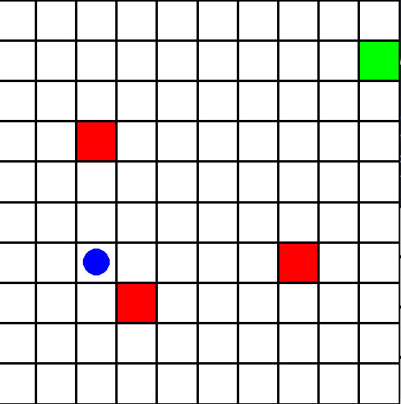

# Using Deep Q Networks to Improve the energy efficiency of Space Air Ground Integrated Networks

## Background
Space Air Ground Integrated Networks (SAGINs) are a new type of network that integrate satellites, air-based deivces such as drones, and ground-based networking devices.
SAGINs have the potential to overcome some of the common problems with modern networks.  
- Highly Adaptable
- High throughput
- High coverage
- Robust  

SAGINs are also facing unique challenges due to their novelty.
- Traffic offloading
- Energy management
- Resource allocation
- Route management
- Signal handover

## Project Aim

This project aims to improve the energy efficiency of SAGINs by optimising the movement of mobile agents in the SAGIN. Unmanned Aerial Vehicles (AKA drones) have limited battery life and processing capabilities. This means they need to be managed carefully to avoid wasting time and energy.  
By optimising the energy efficiency of SAGINs, the output of the network will also be improved.

### Environment
The environment reporesents a subset of a SAGIN. It consists of a mobile agent (i.e., an airborne drone) and several fixed nodes (i.e., ground-based sensors).  
The agent needs to navigate within range of the nodes in order to receive a signal from them.  
There is no limit to the characteristics of the environment:
- Multiple nodes that activate randomly
- Nodes with different ranges
- Nodes with different activation periodes (i.e., priority levels)

### Deep Q Network
Deep Q Learning is concerned with the actions of the agent in the environment.  

The goal of this project is to train a neural network (known as a Deep Q Network) that can select the optimal action for the agent based on the environment's state.  

